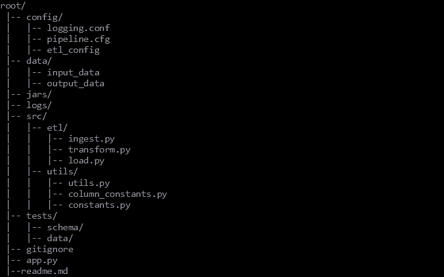

# PySpark Boilerlpate for Beginners

This repo is for an end to end yet simple pyspark boilerplate 
Please feel free to use it. 

## Direcotry Structure

## Features:
- Config Management             -- Present
- Logging                       -- Present
- Modular code                  -- Present
- Continuous Integration        -- Present
- Continuous Deployment         -- TBD
- Unit Tests                    -- Work in Progress
- Code Coverage Report          -- Present
- Packaging                     -- Work in Progress
- Job Submission                -- Work in Progress

### To be Done:
- Docker
- Airflow DAG 

### Other Projects I am working on 
1. Spark Scala Archetype
2. Production grade ML Boilerplate
3. Spark Java Archetype